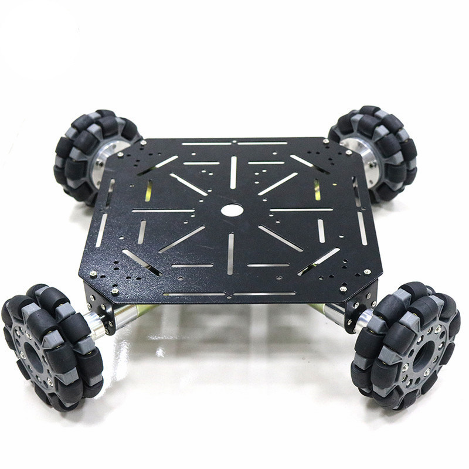

# NWCH

# Introduction
This is library provides simplified functions to execute planar twists for a robot using omni-wheels in a concentric arrangement. The code is compatible with ATMEGA microcontrollers, commonly found in Arduino development boards. The number of wheels can vary beyond a minimum of 2.

<p align="center">
  
</p>

<p align="center">
    Fig: example 4-wheel omni wheel robot base.
</p>

# Index
- [Introduction](#introduction)
- [Index](#index)
- [Theory](#theory)
- [Users Guide](#users-guide)
    - [Downloading This Library](#downloading-this-library)
    - [Examples](#examples)
- [Developers Guide](#developers-guide)
    - [Files](#files)
    - [Class Description](#class-description)
# Theory
(to be updated soon)

# Users Guide

## Downloading This Library
It is recommended to clone the entire repository into the  libraries folder of the installed Arduino folder  on your local machine. Use the command:
```
git clone https://github.com/arthurgomes4/NWCH.git
```
Ensure that the command is run from the mentioned libraries directory.

**Note**: This library is dependent on [sio](https://github.com/arthurgomes4/sio) for debugging functionalities so ensure that you have it downloaded as well in the same libraries folder.

## Examples
(to be updated soon)

# Developers Guide

## Files
A description of all the files contained in this library folder.
### NWCH.h
This is the header file containing the class blueprints.
### NWCH.cpp
This file contains the source code for the function prototypes declared in the header file.
### README.md
A markdown file containing the general description of the library.

## Class Description
The contents of the NWCH class are detailed and listed further in this section. This class publically inherits from sio.
### Global
- Variables
    - ```const int wheel_limit = 6```: limit for number of wheels the robot can have. NOTE: this is not contained in the NWCH class definition.
### Public
- Functions
    - ```NWCH()```: empty constructor
    - ```NWCH(int, int*)```: parametrised constructor to set the number of wheels and the angles made by the axes of rotation with the bots local X axis. 
    - ```NWCH(String, Stream*)```: parametrised constructor to set serial monitor bus and connection name for debugging.
    - ```NWCH(String, Stream*, int, int*)```: parametrised constructor to initialize connection name, serial monitor bus, number of wheels and angles. 
    - ```void attachDirPins(int*)```: initializes the direction pins array from the values in the passed array.
    - ```void attachPwmPins(int*)```: initializes the pulse width modulation pins array from the values in the passed array.
    - ```void attachPins(int*,int*)```: does both of the above functions.
    - ```void setSio( String, Stream* )```: sets the  serial monitor bus and connection name for debugging.
    - ```void setRadii()```: set unit wheel radii for all wheels.
    - ```void setRadii( float* )```: set wheel radii for all wheels as passed array of floats.
    - ```void setOffset( float )```: set angular offset from x-axis for default forward heading. 
    - ```void setWheels( int )```: passed integer argument is set as the number of wheels.
    - ```void setAngles( int* )```: wheel angles are set as the values passed in the integer array. DEGREES only.
    - ```void setVelocities()```: sets all velocities to 0.
    - ```void setDirections()```: sets all wheel directions to True. 
    - ```void setDirections( bool* )```: sets wheel directions as per boll array passed as arguement.
    - ```void execute(int,float,int)```: Calculates and writes pwm values to the output pins to command desired planar twist. 

    [](https://code.visualstudio.com/)
[](https://github.com/arthurgomes4)
